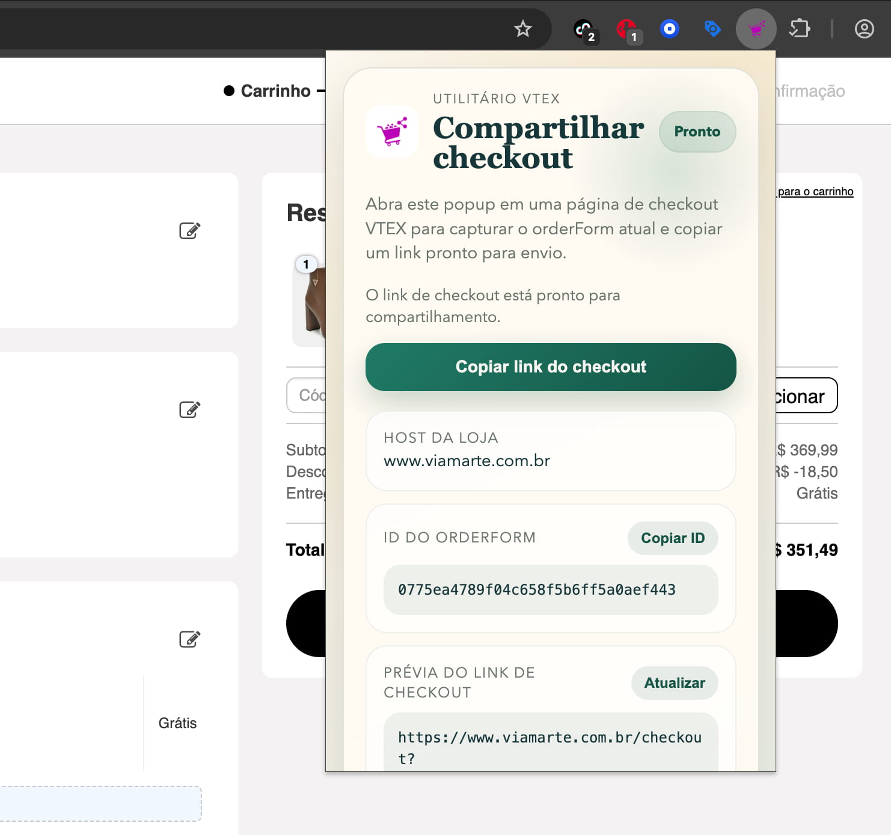
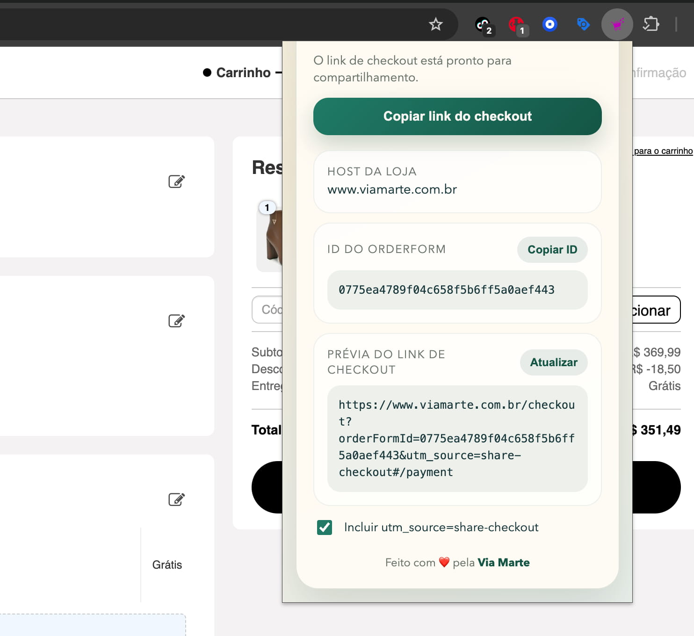

# Share Checkout VTEX

Extensão de navegador para capturar o `orderFormId` em páginas de checkout VTEX e copiar um link de checkout pronto para compartilhar com clientes.

[](https://chromewebstore.google.com/detail/share-checkout/hebhfmfndgdkopnndefocodlialmgkch)

Instalação pela Chrome Web Store: https://chromewebstore.google.com/detail/share-checkout/hebhfmfndgdkopnndefocodlialmgkch

## Escopo da extensão

Esta extensão faz uma única tarefa:

- Detecta quando a aba atual está em uma URL que contém `/checkout`
- Quando o usuário abre o popup, lê `window.vtexjs.checkout.orderFormId` apenas na aba ativa
- Abre um popup no ícone da extensão com o `orderFormId`, o host atual e a prévia do link
- Copia um link no formato `https://host/checkout?orderFormId=...` preservando hash e outros query params
- Permite incluir opcionalmente `utm_source=share-checkout`
- Exibe textos em inglês ou português do Brasil, conforme o idioma da interface do navegador

Não há painel lateral, botão flutuante na página ou fluxo adicional fora desse popup.

## Uso

### 1. Abra um checkout VTEX válido

Com a loja já aberta em uma URL com `/checkout`, clique no ícone da extensão na toolbar do navegador. O popup abre com o status atual, a ação principal de cópia e os dados já capturados da aba ativa.



### 2. Copie o link principal sem sair do topo do popup

Na maior parte dos casos, o usuário só precisa clicar em **Copiar link do checkout**. Quando o `orderFormId` está disponível, o botão principal já fica visível antes dos demais cards para agilizar esse fluxo.

### 3. Confira os detalhes antes de compartilhar

Logo abaixo do botão principal, o popup mostra:

- O Host Da Loja Detectado
- O ID Do OrderForm Atual
- A Prévia Do Link Final De Checkout
- O Controle Para Incluir Ou Remover `utm_source=share-checkout`

Também é possível copiar apenas o ID do orderForm ou atualizar a leitura da aba atual.



### 4. Compartilhe o checkout gerado

O link final reaproveita o checkout aberto na aba atual, preserva hash e query params relevantes e adiciona `utm_source=share-checkout` somente quando essa preferência estiver ligada.

## Como funciona

### 1. Popup

O popup fica em `src/popup/` e é aberto ao clicar no ícone da extensão. Ele:

- Consulta a aba ativa
- Injeta a leitura do checkout apenas na aba ativa atual
- Mostra o `orderFormId` detectado
- Deixa o usuário copiar o ID ou o link completo
- Mostra uma mensagem de indisponibilidade quando o checkout VTEX não foi detectado

No Chromium, a coleta sob demanda usa `activeTab` com `chrome.scripting`. No Firefox, a leitura usa `activeTab` com `tabs.executeScript`.

### 4. Regras de geração do link

O link copiado sempre usa:

- O protocolo atual da página, `http` ou `https`
- O host atual
- O caminho fixo `/checkout`
- O `orderFormId` como primeiro query param
- O `utm_source=share-checkout` apenas quando o checkbox estiver ligado
- Os outros query params existentes, exceto duplicatas de `orderFormId` e `utm_source`
- O hash atual da URL

## Permissões e premissas

### Permissões usadas

- A permissão `clipboardWrite` é necessária para copiar o link e o `orderFormId`
- A permissão `activeTab` limita a leitura da aba atual ao momento em que o usuário abre a extensão
- No Chromium, a permissão `scripting` é necessária junto com `activeTab` para injetar a leitura sob demanda em Manifest V3

### Premissas VTEX

- A extensão depende de `window.vtexjs.checkout.orderFormId`
- A extensão só considera uma aba válida quando a URL atual contém `/checkout`
- Se a loja não expuser esse objeto, o popup mostrará o estado como indisponível e o botão de cópia ficará desabilitado

## Estrutura do projeto

```text
images/
├── popup_demo_1.jpg
└── popup_demo_2.jpg

public/

src/
├── images/
│   └── icon.png
├── popup/
│   ├── index.html
│   ├── PopupApp.js
│   ├── scripts.js
│   └── styles.css
├── shared/
│   └── checkout.js
└── manifest.json

test/
└── checkout.test.js
```

## Scripts disponíveis

### Desenvolvimento

```bash
npm run dev
```

Também é possível escolher o navegador:

```bash
npm run dev -- --browser=chrome
npm run dev -- --browser=edge
npm run dev -- --browser=firefox
```

### Build

```bash
npm run build
npm run build:chrome
npm run build:firefox
npm run build:edge
```

### Testes

```bash
npm test
```

Esse teste cobre a lógica compartilhada de:

- Normalização do `orderFormId`
- Detecção de checkout
- Geração do link final
- Suporte a locale `en` e `pt-BR`

### Preview

```bash
npm run preview
```

## Compatibilidade

A base continua única para Chromium, Chrome, Edge e Firefox. As diferenças por navegador ficam concentradas no manifesto e no acesso às APIs de injeção sob demanda a partir do popup.

No Chrome e outros navegadores Chromium, isso significa `activeTab` mais `scripting` por causa do Manifest V3. No Firefox, `activeTab` é suficiente para a injeção programática usada hoje.

## Limitações conhecidas

- Páginas bloqueadas pelo próprio navegador para extensões não poderão ser lidas
- Se a plataforma VTEX mudar a disponibilidade de `window.vtexjs.checkout.orderFormId`, a extensão precisará ser ajustada
- A extensão não gera checkout do zero; ela apenas reaproveita o checkout aberto na aba atual

## Referências

- Documentação do Extension.js: [extension.js.org](https://extension.js.org)
- Pacote extension no npm: [npmjs.com/package/extension](https://www.npmjs.com/package/extension)

## Autor

Projeto de CALCADOS MARTE LTDA (Via Marte).

Contato: [matheus@viamarte.com.br](mailto:matheus@viamarte.com.br)

Site: [www.viamarte.com.br](https://www.viamarte.com.br)

## Licença

Este projeto está licenciado sob a licença MIT.

Consulte o arquivo [LICENSE](./LICENSE) para o texto completo.
